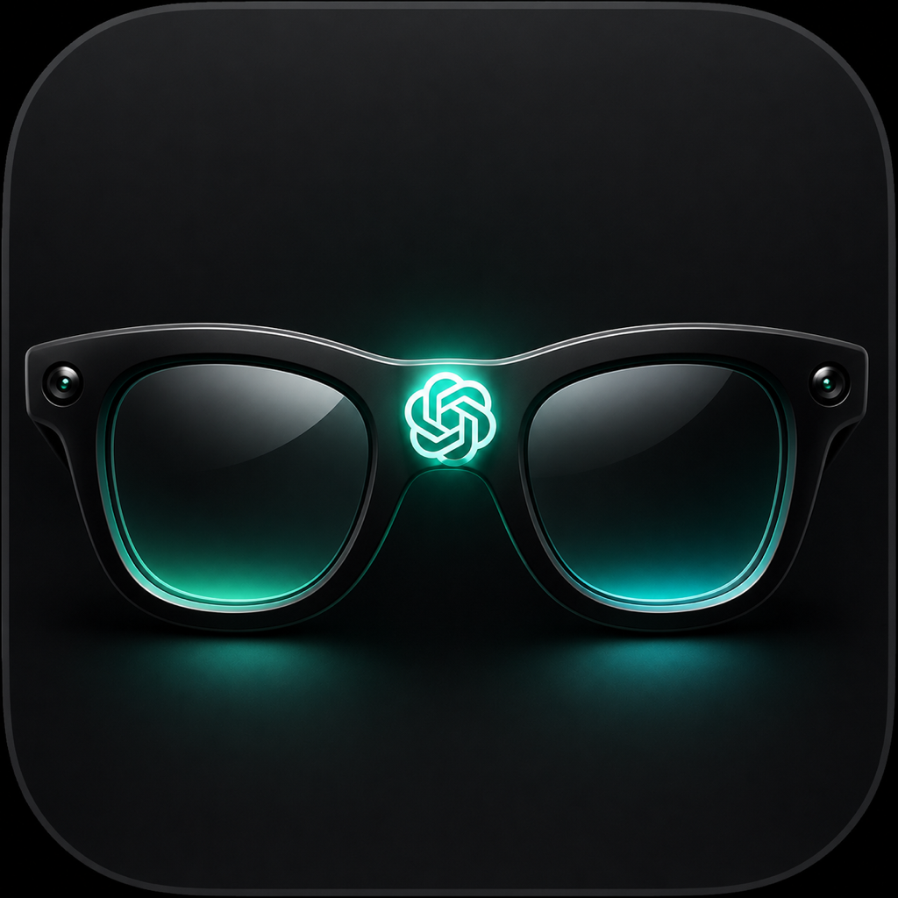

# GlassGPT

<p align="center">
  
</p>

<p align="center">What if Meta Glasses were built by Apple and OpenAI?</p>

GlassGPT is an open-source project that shows what would happen if the Meta Glasses were built by Apple and OpenAI. It takes the Meta hardware, powers it via the OpenAI Realtime model, and embeds it into iOS through App Intents so that the model can take action on the operating system. It represents a vision of what a very good class of form factor for an AI agent could be if we were not in a walled-garden ecosystem.

> [!WARNING]
> This is an independent community project, not an official Meta, Apple, or OpenAI product. Meta Wearables access, an eligible pair of glasses, and a physical iPhone are required for the core glasses experience.

## What it does

- Starts real-time voice conversations using the **glasses microphone** and sends assistant audio to the glasses. Debug Audio Mode can also play that output from the iPhone speaker.
- Optionally shares a current glasses camera frame as visual context during a conversation.
- Lets the assistant perform user-authorized native iOS actions: reminders, calendar events, Maps directions, timers and notifications, location-based reminders, contacts and call handoff, Apple Music playback, and photo access.
- Displays session state through a Live Activity on the Lock Screen and Dynamic Island, when supported by the device.
- Provides clear in-app settings for the permissions needed by each capability.

## Project goal

GlassGPT is a practical reference for building an iPhone-first assistant around smart glasses. The goal is to make real-time AI useful in the moment—seeing what the wearer sees, hearing a natural request, and safely handing off an action to the iOS system—without giving an agent unrestricted access to a user's device or data.

The project is intentionally useful to contributors who want to learn about SwiftUI, Meta Wearables DAT, OpenAI Realtime, and Apple system frameworks in one place. Contributions that improve accessibility, privacy, reliability, and the quality of these integrations are especially welcome.

## Built with Codex

I collaborated with Codex throughout the project as a hands-on engineering partner, while retaining ownership of the product direction, technical tradeoffs, and final decisions. I used GPT-5.6 and Codex to inspect the existing SwiftUI and Meta Wearables codebase, translate product ideas into implementation plans, implement and refine features, diagnose device logs, and verify iPhone and simulator builds.

Codex accelerated the work most in the integration-heavy parts of the project. It helped build the OpenAI Realtime WebSocket client, configure Bluetooth HFP audio for the glasses, resample the glasses microphone from its 16 kHz hardware format to Realtime PCM, attach a fresh compressed camera frame to vision requests, and implement safe interruption so a new spoken question cancels queued assistant audio. It also helped evolve the iOS-native action layer for reminders, calendar events, Maps, notifications, location, contacts and calling, Apple Music, and Photos, with capability toggles, permissions, validation, and confirmation before actions execute.

I made the key product decisions through rapid testing on real hardware. For example, I chose to prioritize conversational reliability over smooth video by reducing the glasses stream to a low-quality 1 fps feed. I also chose a low-eagerness semantic VAD configuration so the assistant waits for a meaningful end to a sentence while still allowing natural barge-in, and I chose an opt-in permission model for every sensitive iOS capability and for location sharing. On the design side, I directed the single-screen Liquid Glass interface, the audio-responsive speaking animation, the background conversation behavior, and the Live Activity experience for the Lock Screen and Dynamic Island.

GPT-5.6 and Codex contributed to the final result by shortening the loop between idea, implementation, device failure, and correction. They helped interpret Realtime API changes and low-level audio, socket, and Meta streaming errors, then turn those findings into focused Swift changes. The result is a solo-built prototype that combines Meta hardware, OpenAI Realtime, and native iOS capabilities into one cohesive, permission-aware assistant experience.

## Requirements

| Requirement | Why it is needed |
| --- | --- |
| macOS and **Xcode 26.5 or later** with the iOS 26 SDK | Builds the SwiftUI app and its Metal-based visual effects. Install the Metal Toolchain if Xcode prompts for it. |
| [XcodeGen](https://github.com/yonaskolb/XcodeGen) | Generates `GlassGPT.xcodeproj` from `project.yml`. |
| A physical iPhone running iOS 26 or later | The iOS Simulator cannot use Bluetooth glasses or Meta Wearables DAT. |
| Meta Ray-Ban glasses paired to the Meta AI app | Supplies the glasses camera, microphone, and audio route. |
| A Meta developer account with Wearables access | Provides the app ID and client token required by Meta Wearables DAT. |
| An Apple Developer signing team | Signs the app for installation on your device. |
| An [OpenAI API key](https://platform.openai.com/api-keys) with Realtime access | Used only for local development to connect the app to OpenAI Realtime. |

## Run locally

### 1. Clone and install XcodeGen

```bash
git clone https://github.com/<your-org>/glassgpt.git
cd glassgpt
brew install xcodegen
```

If needed, install the Metal toolchain from Xcode's Components pane, or run:

```bash
xcodebuild -downloadComponent MetalToolchain
```

### 2. Create local configuration

```bash
cp Config.xcconfig.example Config.xcconfig
```

`Config.xcconfig` is ignored by Git. Fill it with the values described below; never commit your real configuration or API keys.

### 3. Generate the Xcode project

```bash
xcodegen generate
open GlassGPT.xcodeproj
```

Xcode resolves the Swift Package dependencies, including Meta's Wearables DAT SDK, on first build.

### 4. Build on your iPhone

1. Select your **physical iPhone** as the run destination in Xcode.
2. Choose your Apple signing team if Xcode asks.
3. Build and run the app (`⌘R`).
4. In GlassGPT, tap **Register** and approve the connection in Meta AI when prompted.
5. Return to GlassGPT and verify that the registration state is **Registered**.
6. Start a session with **Open my eyes** and grant only the permissions you want to enable in Settings.

You can confirm the connection in Meta AI under **Settings → App connections → Developer mode apps**.

## Configuration reference

All local values live in `Config.xcconfig`, created from [`Config.xcconfig.example`](Config.xcconfig.example).

| Key | Value to provide |
| --- | --- |
| `DEVELOPMENT_TEAM` | Your 10-character Apple Developer Team ID. Find it in the Apple Developer portal or Xcode's account settings. |
| `PRODUCT_BUNDLE_IDENTIFIER` | A bundle identifier you control, for example `com.example.glassgpt`. It must exactly match the identifier registered with Meta and Apple. |
| `WIDGET_BUNDLE_IDENTIFIER` | A unique identifier for the Live Activity widget, normally `${PRODUCT_BUNDLE_IDENTIFIER}.widget`. |
| `META_APP_ID` | The numeric App ID from the Meta Wearables Developer Center. |
| `CLIENT_TOKEN` | The full Meta client token, in the form `AR|APP_ID|TOKEN`. Do not omit the `AR|` prefix. |
| `APP_LINK_URL_SCHEME` | A unique custom URL scheme, for example `glassgpt`. |
| `OPENAI_API_KEY` | A development-only OpenAI API key with access to Realtime. |

### Important: OpenAI key security

The sample configuration embeds `OPENAI_API_KEY` in a development build. This is convenient for personal testing but is not safe for a distributed app: anyone with the app binary can potentially recover a long-lived key. Before shipping, replace this path with your own authenticated backend that mints a short-lived Realtime client credential. See OpenAI's [Realtime API documentation](https://developers.openai.com/api/docs/guides/realtime) for the recommended credential model.

## Create and configure a Meta Wearables app

Meta's portal wording and navigation can change, so follow the current prompts in the [Wearables Developer Center](https://wearables.developer.meta.com/) if they differ from the steps below.

1. Sign in to the Wearables Developer Center with your Meta developer account.
2. Create a new app, or open an existing one, and enable the **Wearables** capability.
3. Configure the app's iOS bundle identifier. It must exactly match `PRODUCT_BUNDLE_IDENTIFIER` in `Config.xcconfig`; change both together if you use your own namespace.
4. Copy the app's numeric **App ID** to `META_APP_ID` and its full **Client Token** to `CLIENT_TOKEN`.
5. Create an **Internal** release channel under **Distribute → Release channels**, add the Meta account used on your phone as a tester, and publish a release. If the portal requires a new version to publish, increment it.
6. On the paired iPhone, accept the tester invitation at [wearables.meta.com/invites](https://wearables.meta.com/invites). This is commonly required before Meta AI exposes an update for the glasses DAT app.
7. In the Meta AI app, pair the glasses, then enable Developer Mode: open **Settings → App Info**, tap the app version **five times**, and turn on **Developer Mode**.
8. Return to GlassGPT, register the app, and approve the request in Meta AI.

If Meta AI says that the DAT app on the glasses needs an update, first verify that the tester invite was accepted and the internal release is published. Then retry the update from GlassGPT Settings or Meta AI's developer-app connections.

## Permissions and privacy

GlassGPT requests system permissions only when a capability needs them. Camera, microphone, photos, contacts, calendars, reminders, notifications, Apple Music, and location access are each governed by iOS and can be changed later in the app or in iOS Settings. The assistant must receive a user request before attempting an operating-system action; iOS may still present its own confirmation or permission dialog.

During a live session, audio is sent to OpenAI Realtime. When visual context is enabled, the app can send a current frame from the glasses camera. Review the terms and privacy information of Meta, Apple, and OpenAI before using the app with sensitive information. Do not use a development key or this prototype as a production security architecture.

## Troubleshooting

| Problem | Suggested fix |
| --- | --- |
| `Config.xcconfig not found` | Copy `Config.xcconfig.example` to `Config.xcconfig` and fill in the required values. |
| Meta configuration is invalid | Check that `CLIENT_TOKEN` uses `AR|APP_ID|TOKEN` and that the app ID/bundle ID match the portal. |
| Registration is unavailable | Enable Developer Mode in Meta AI, keep the glasses connected, then retry. |
| No update button / DAT app needs update | Publish the internal release, accept its tester invitation, then retry from Meta AI or the app. |
| Bluetooth, L2CAP, or streaming errors | Wear the glasses with hinges open, open Meta AI, wait for the connection chime, and retry. A 30-second power cycle in the case can help. |
| Signing fails | Set `DEVELOPMENT_TEAM` to the Apple team that owns your bundle identifier. |

For additional project-specific setup notes, see [SETUP.md](SETUP.md).

## Contributing

Contributions are welcome. Please read [CONTRIBUTING.md](CONTRIBUTING.md) for the development workflow, testing expectations, PR guidance, and rules for handling credentials and user data.

## License and third-party notices

GlassGPT is released under the [MIT License](LICENSE). Third-party attribution and license notices are collected in [THIRD_PARTY_NOTICES.md](THIRD_PARTY_NOTICES.md).
